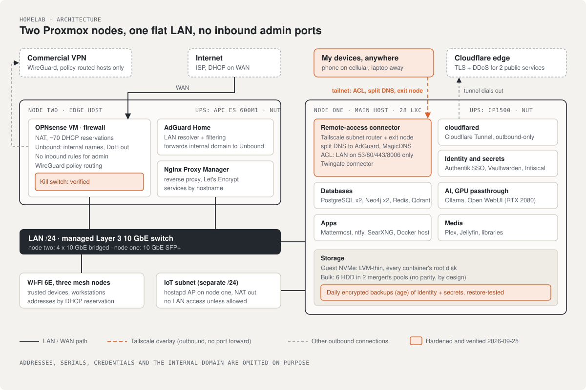

# Homelab: two Proxmox nodes, hardened and documented

**Showcase page:** https://jerry-builds.github.io/homelab-docs/

The lab I run at home in Oregon: two Proxmox VE 9 hosts, 28 LXC containers, a virtualized OPNsense firewall, and the networking, DNS, remote access, identity, backup and power around them. I audited it the way I'd audit someone else's environment, fixed what I found, and **tested every fix from the side a failure or an attacker would come from**.

## At a glance

| | |
|---|---|
| **Compute** | Two Proxmox VE 9 nodes. Main host: Ryzen 9 5950X, 64 GB, RTX 2080 shared into containers. Edge host: runs the firewall and DNS, so the network stays up when the main host is down |
| **Network** | Managed Layer 3 10 GbE switch, OPNsense VM, split DNS (AdGuard Home + Unbound, DNS-over-HTTPS upstream), separate NAT'd IoT subnet, ~70 DHCP reservations named by role |
| **Remote access** | Tailscale (subnet router, exit node, tag-based ACL with policy tests), Twingate, Cloudflare Tunnel. **No inbound firewall rules for administration** |
| **Identity and secrets** | Authentik SSO, Vaultwarden, Infisical |
| **Backups** | Daily application-level backups, age-encrypted to a key kept off the host, **restore-tested on another machine** |
| **Power** | NUT on both nodes; guests stop cleanly, then the host halts |
| **Storage** | LVM-thin on NVMe for guest disks; six HDDs in mergerfs pools with no parity, a deliberate trade explained in [operations.md](operations.md) |

## If you only read one page

**[hardening.md](hardening.md).** It covers seven fixes, each with what was wrong, what changed, and how it was proven. Examples:

- the VPN kill switch that leaked when the tunnel dropped;
- the Docker API left open on the LAN;
- the Tailscale ACL whose own tests must pass before it saves;
- a laptop that started sending its LAN traffic through the tailnet.

## Contents

| File | Covers |
|---|---|
| [hardening.md](hardening.md) | The seven fixes from my September 2026 audit, and the tests that proved each one |
| [network.md](network.md) | Addressing, routing, firewall, DNS design, the isolated IoT subnet |
| [remote-access.md](remote-access.md) | Tailscale, Twingate and Cloudflare Tunnel: what each is for and how Tailscale is locked down |
| [node-one.md](node-one.md) | The main host: hardware, storage tiers, containers by function, GPU passthrough |
| [node-two.md](node-two.md) | The edge host: OPNsense VM, AdGuard Home, reverse proxy |
| [operations.md](operations.md) | The audit findings, backups, power, the drive failure, monitoring |
| **Runbooks** | |
| [restore-from-backup.md](runbooks/restore-from-backup.md) | Decrypt, verify and restore a service |
| [ups-power-loss.md](runbooks/ups-power-loss.md) | What happens on battery, safe tests, recovery order |
| [tailscale-new-device.md](runbooks/tailscale-new-device.md) | Add a device and prove its access is what the ACL says |

## Why I keep this

For the same reason I kept design docs at work: if I can't explain a design choice in writing, I don't understand it well enough to support it.

## History

The lab ran on Unraid for two years, with Docker containers on top of the Unraid array and parity for bulk storage. I moved to Proxmox in 2024 because I wanted:

- proper Linux containers with their own IPs;
- a real virtualization layer for the firewall;
- LVM-thin snapshots for guest disks.

Unraid's storage model was the part I missed. That's why the bulk disks here are mergerfs pools rather than ZFS: I wanted the same "each disk stands alone" failure mode.

## Conventions and sources

- Most containers were created with the [community-scripts/ProxmoxVE](https://github.com/community-scripts/ProxmoxVE) helper scripts and carry a `community-script` tag. Where I changed what a script did, the notes say so.
- Nothing here is inferred from intent. It was read from the running systems with `pct`, `pveversion`, `lsblk`, `ss` and the OPNsense config export, then rewritten by hand.
- Addresses, hardware serials, credentials and the internal domain are left out on purpose.
